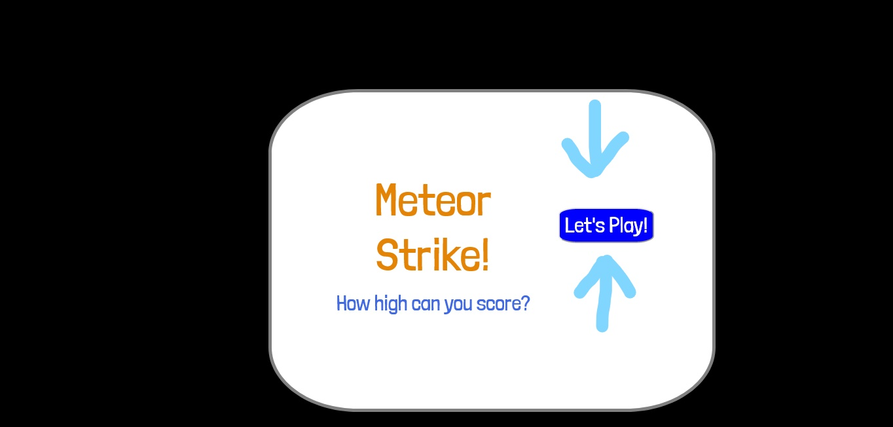
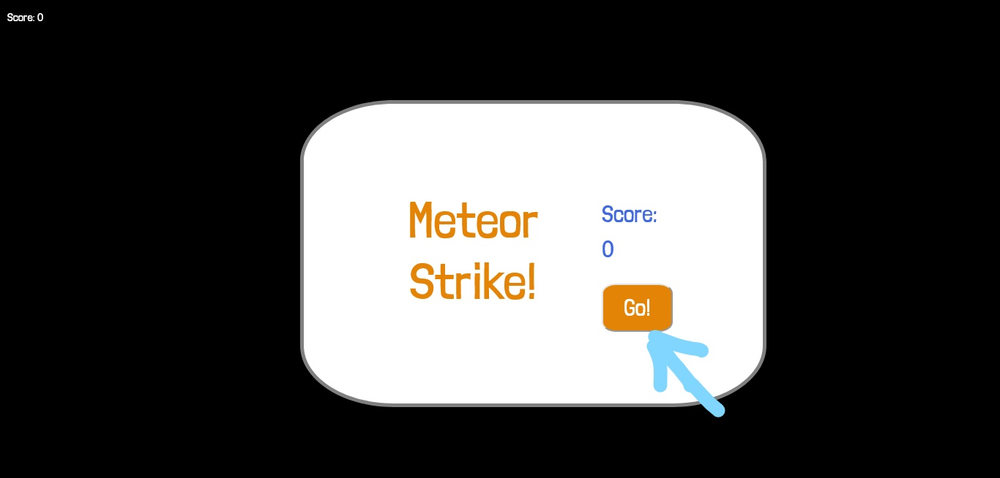
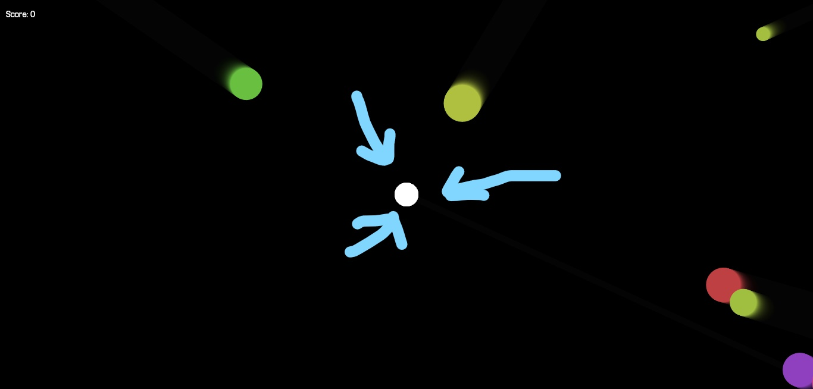
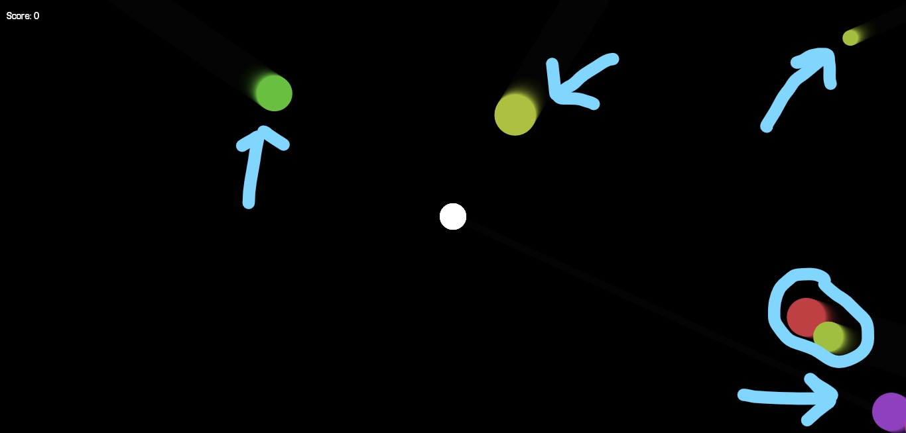
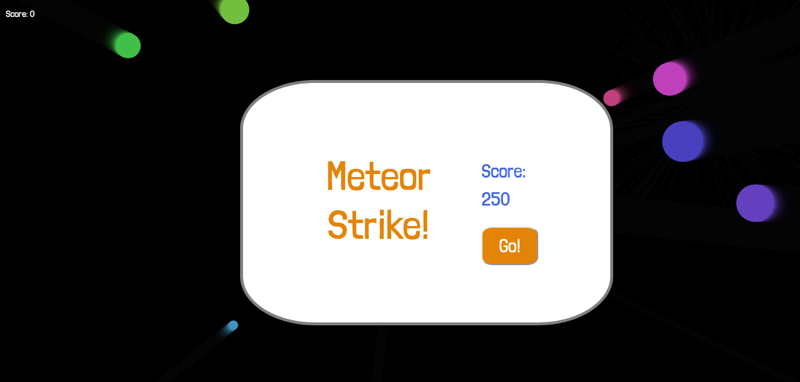
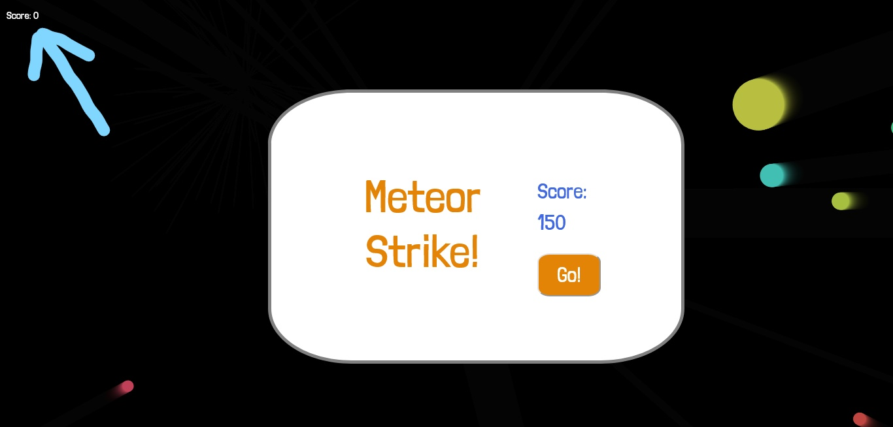
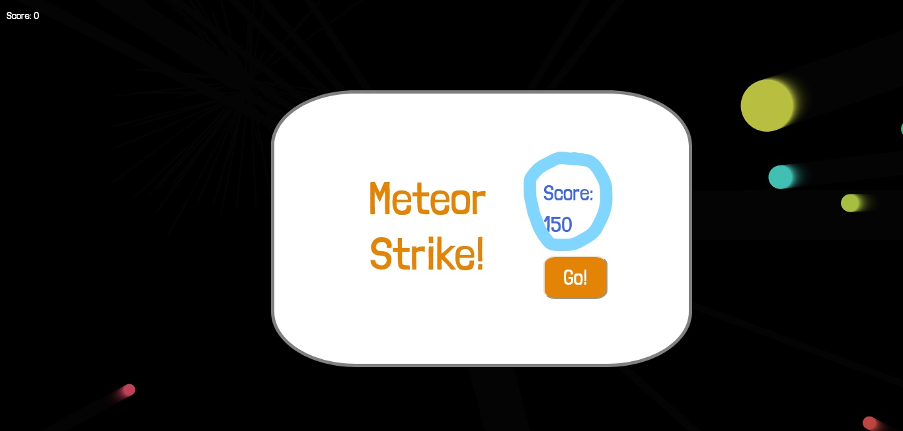

# Meteor strike Game- Testing details
[Main README.md file.](README.md)

[View the live website](https://staffordcian99.github.io/meteor-strike/)

## Validation:
* [W3C CSS Validation](http://www.w3.org/)
* [W3C Markup Validation](https://validator.w3.org/)
* [JSHint Javascript Validation](https://jshint.com/)

The W3C CSS Validation Service, W3C Markup Validation Service and JSHint Javascript validation service were used to check the validity of the website and game code.

## User stories testing:
### 1. As a user, I want to be able to easily start the game:
1. While on the home page click on the "Let's Play" button which will bring you to the game page.

2. Once on the game page click the "Go!" button to begin the game.

### 2. As a user, I want the game to be functional:
* Player:
1. Once the "Go!" button is clicked the game will display.
2. The player should be a white circle located in the centre of the screen.

* Enemies:
1. Once the "Go!" button is clicked the game will display.
2. The enemies should begin to spawn from the edges of the screen.
3. Once spawned the enemies should move directly towards the player.

* Rockets:
1. Once the "Go!" button is clicked the game will display.
2. click anywhere on the screen.
3. Ensure that the rockets travel directly from the centre of the screen to where the screen was clicked.

* Function:
1. Once the "Go!" button is clicked the game will display.
2. Click on the screen to launch a rocket towards an enemy.
3. Once they both collide the rocket should remove from the screen and particles should appear.
4. Also once they collide large enemies should shrink and small enemies should be removed from the screen.
5. Let an enemy collide with the player.
6. once the collision is detected the game will end.

### 3. As a user, I want to keep track of my score and improve at the game:
1. On the home screen, click the "Let's Play" button to bring you to the game page.
2. Once on the game page a div should be present in the top left corner.

3. click on "Go!" button to start the game.
4. Click on the screen to launch a rocket towards an enemy.
5. Each time a rocket and an enemy collide the score will update.
6. Allow an enemy to collide with the player to end the game.
7. When the game has ended the score you achieved will be displayed above the "Go!" button.

## Other feature testing:
### Button color change:
1. Hover the mouse over the "let's play" button.
2. The color will change to salmon while the mouse is above it.
3. Move the mouse away from the button and it will be its original color.
4. Repeat these steps for the "Go!" button on the game page.

### Link:
1. On the home screen, click the "Let's Play" button
2. This will bring you to the game page.